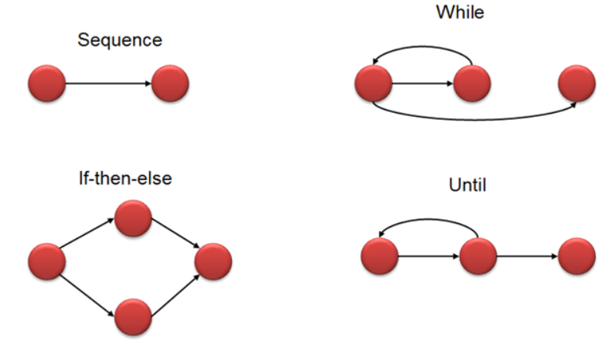
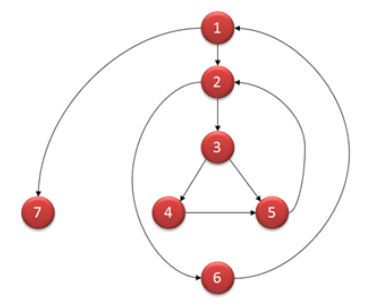

## 1.1 - Static Analysis

We have looked at some static analysis tools like StyleCop, PMD, FindBugs and SonarLint. 
Explain how static analysis can improve code quality. 
Explain how it helped you or could have helped you in your project.

***

### Static Analysis generally

Static Analysis is the automated analysis of source code without executing the application.

When the analysis is performed during program execution then it is known as Dynamic Analysis.

Static Analysis is often used to detect:

- Security vulnerabilities (Such as security risks of SQL injections)
- Performance issues (Cyclomatic Complexity - Duplicated Code - Unused functions, variables or classes)
- Non-compliance with standards.
- Use of out of date programming constructs (Deprecated libraries and classes)

All the above will create vulnerabilities in a program, whether it's related to potential security breaches, 
performance issues or future disabled functions which results in a non-functional code.

Therefore, using a static analysis tool will greatly increase your chances of improving the code, 
which will result in a better product in the end.

Another useful usage for static analysis tools are for junior developers to get a better understanding 
of where to focus on improving their skills and thus creating better code.

#### Automated Approaches - Model
- Cyclomatic Complexity (CC)
    - A metric used to indicate the complexity of a program
    - Higher number = More complex code = Bad.

Flow graphs are used to calculate CC within a software program.

Formula for calculating code complexity:

    V(G) = E - N + 2
V(G) = the maximum number of independent paths in the graph.\
E = Number of edges.\
N = Number of nodes.

    V (G) = P + 1
P = predicate nodes. (Nodes that contain conditions)

Example:

    i = 0;
    n=4; //N-Number of nodes
    
    while (i<n-1) do
    j = i + 1;
    
    while (j<n) do
    
    if A[i]<A[j] then
    swap(A[i], A[j]);
    
    end do;
    i=i+1;
    
    end do;

    V(G) = 9 – 7 + 2 = 4
    V(G) = 3 + 1 = 4 (Condition nodes are 1,2 and 3 nodes)
    Basis Set – A set of possible execution path of a program
    1, 7
    1, 2, 6, 1, 7
    1, 2, 3, 4, 5, 2, 6, 1, 7
    1, 2, 3, 5, 2, 6, 1, 7

Basis Path testing is one of White box technique, and it guarantees to execute at least one statement during testing.
It checks each linearly independent path through the program, which means number test cases, will be equivalent
to the cyclomatic complexity of the program.

This metric is useful because of properties of Cyclomatic complexity (CC) –

1. CC can be number of test cases to achieve branch coverage (Upper Bound)
2. CC can be number of paths through the graphs. (Lower Bound)

    If (Condition 1)
    Statement 1
    
    Else
    Statement 2
    
    If (Condition 2)
    Statement 3
    
    Else
    Statement 4

Cyclomatic Complexity for this program will be 8-7+2=3.

| Complexity number | Meaning                                                                          |
|-------------------|----------------------------------------------------------------------------------|
| 1 - 10            | Structured and well written code High Testability  Cost and Effort is less |
| 10 - 20           | Complex Code  Medium Testability  Cost and effort is minimum               |
| 20 - 40           | Very complex code  Low testability  Cost and efforts are High              |
| >40               | Not at all testable  Very high Cost and Effort                                |

Other tools for static analysis:
- Checkstyle
    - Coding standards and conventions.
- FindBugs
    - Finds bugs and potential future bugs
- PMD
    - Warns about bad practices

***

#### Security

Using static analysis tools, you can also increase the overall security of the SUT.

Common things that static analysis tools can help find:

- SQL injection vulnerabilities
- Recommended encryption standards
- Key Generation recommendations
- And much more...

#### Code smell

A code smell is a surface indication that usually corresponds to a deeper problem in the system.

Code smells are subjective and vary based on developer, language, and methodology, among other factors.

It is an essential part of software development to find code smells, dig into the underlying causes and fix them via refactoring.

- <ins>Bloaters</ins>: This includes code, like methods and classes, that has become huge over time by accumulating 
functionality and feature creep.
E.g., long methods, god-classes, long parameter lists.
- <ins>Dispensable</ins>: This refers to dead code, which is not being invoked or executed. These blocks of code are 
unnecessary, as they provide no benefits but increase technical debt.
E.g., duplicated code, refactoring artifacts, premature generalization.
- <ins>Couplings</ins>: This means a code that should be independent ends up tied together because of excessive 
delegation or lack/absence of access control.
E.g., code forwarding, use of internal or private members.

#### Technical debt

Technical debt (also known as tech debt or code debt)
describes what results when development teams take actions to expedite the delivery of a piece of
functionality or a project which later needs to be refactored. \
In other words, it's the result of prioritizing speedy delivery over perfect code.

### Programs and plugins for static analysis

#### QAPlug

A static analysis tool that we have worked with during our semester is called QAPlug

QAPlug manages code quality which integrates tools such as PMD, CheckStyle and FindBugs.

###### PMD

PMD is a source code analyzer.

It finds common programming flaws like 

- Unused variables
- Empty catch blocks
- Unnecessary object creation
- Copy-Paste-Detector

###### CheckStyle

Checkstyle is a development tool to help programmers write Java code that adheres to a coding standard. \
It automates the process of checking Java code to spare humans of this boring (but important) task. \
This makes it ideal for projects that want to enforce a coding standard.

Checkstyle is highly configurable and can be made to support almost any coding standard.

###### FindBugs

FindBugs is a plugin to detect bugs in a source code.
When run, it generates a review with an overview of the bugs found.

A review is a classification of an issue as:
- Must-fix
- Should-fix
- Mostly-harmless
- Not-a-bug
- And several other categories.

#### SonarLint

SonarLint is a free IDE extension to find and fix bugs, 
vulnerabilities and code smells as you write code! Like a spell checker, 
SonarLint highlights issues on the fly and provides quick fixes or clear remediation 
guidance to help you clean the code before it is even committed. \
With support for several popular and classic languages, SonarLint helps developers of all experience and skill levels 
write efficient, safe code.
