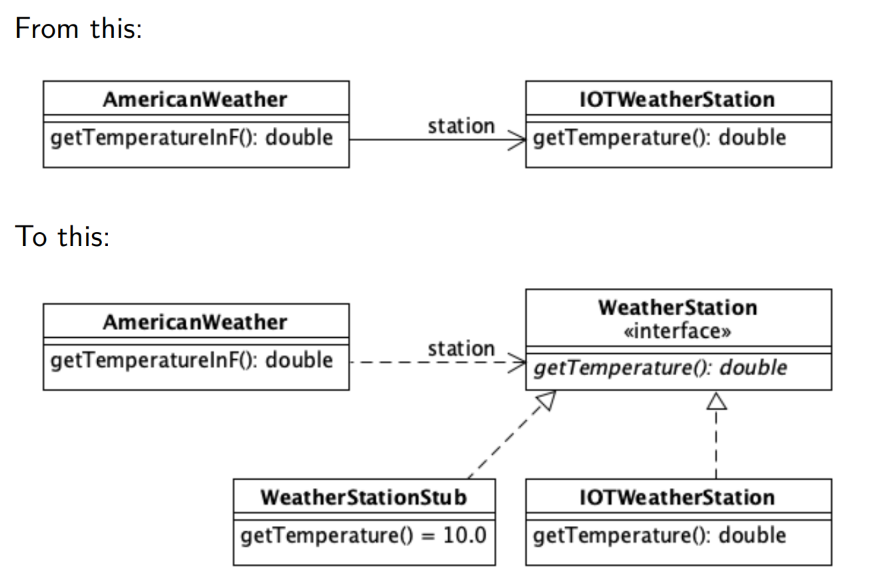
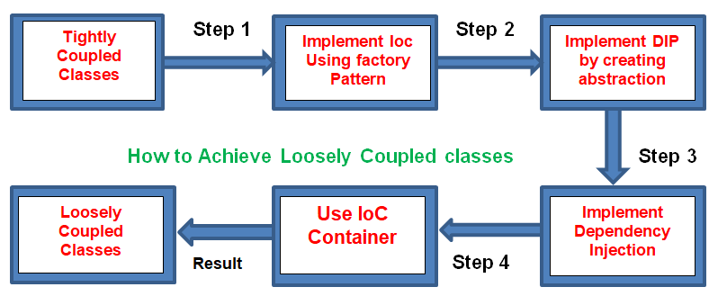
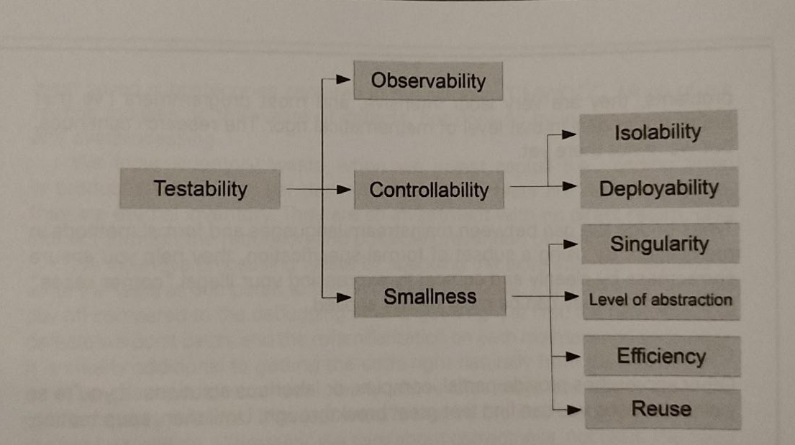

## 1.10 - High Quality Software.
Characterize high quality software. 
Explain how writing tests can increase code quality.
***
###Bonus - Not a part of real questions

####How to Measure Code Quality?\

### Defensive programming

* Require your preconditions to hold
* Ensure your postconditions hold 
* Check your invariance ¯\_(ツ)_/¯

**ACID Principle**

###### - Atomicy

The transaction must be completed fully. If it is not completed fully it will not be recorded.

###### - Consistency

Any change must not break the database. It must be consistent with how it was before the change.

###### - Isolation

A transaction must be isolated and not interfere with another transaction.

###### - Durability

A transaction must remain in the database.

***
### Black-box development

**Black box**Don't have  access to source code

_"Black box approach imposes an emotional distance from the target of the test"_ - le book s23

Questions to keep in mind

* What is its interface to the outside world?
* What inputs does it take? (Have all allowed values been specified?)
* How does it communicate success or failure?
* How does it react to bad input? (Does it recover or crash?)
* Does it surprise by doing something unexpected or unusual?

Typical methods to blackbox:

* FileUpload()
* ReadTextFile()
* SendEmail()
* WatermarkImage()
* ResizeImage()

***
### Interfaces, contracts

Interfaces are used in something like Stubs where you create a stubclass where an interface extends the method.

***
### Inversion of control

Inversion of Control (IoC) is a programming principle.\
IoC inverts the flow of control as compared to traditional control flow.

The general purpose of using IoC is to create looser coupling between classes, and thereby increasing testability and
maintainability.

To fulfill IoC, you need to make object creation responsibility external compared to making each method/class
instantiating objects by themselves.\
This way you will make a much looser coupling between classes/methods, and also adding re-usability of the different
objects which makes the system use less resources as well.

##### *How to achieve loose coupling using IoC containers.*

Step 1:
- You have a bunch of tightly coupled classes.

Step 2:
- You implement the IoC using factory patterns.

Step 3:
- You create abstraction between classes by using a Dependency Inversion Principle (DIP) which involves creating
  interfaces for the classes to communicate with each other.

Step 4:
- You implement Dependency Injection by changing the method/classes, so they take the necessary objects as parameters
  instead of instantiating the objects themselves.

Step 5:
- You create a IoC container (a sort of 'objectFactory') which holds all the objects which are needed for different
  classes/methods.

Step 6:
- You now have a much looser coupling between classes/modules, which helps with testing, maintenance and further
  development.

***
### Dependency injection

Dependency Injection is a programming technique that makes a class independent of its dependencies. “In software engineering, dependency injection is a technique whereby one object supplies the dependencies of another object.

If a function/object/module depends on some other function/object/module, it should not go out and get what it needs. Instead, we explicitly give it anything it needs, typically by passing it in as a function parameter.

example:

    public class TestInfoTest {
        //constructor with depencency injection
        TestInfoTest(TestInfo testInfo) {
            assertEquals("TestInfotest", testInfo.getDisplayname());
        }
    
        @BeforeEach
        void setUp(TestInfo testInfo) {
            String displayName = testInfo.getDisplayName();
            assertTrue(displayName.equals("display name of the method") ||
                       displayName.equals("testGetNameOfTheMethod(TestInfo)"));
        }
    
        @Test
        void testGetNameOfTheMethod(TestInfo testInfo) {
            assertEquals("testGetNameOfTheMethod(TestInfo)",
                    testInfo.getDisplayName());
        }
    
        @Test
        @DisplayName("display name of the method")
        testGetNameOfTheMethodWithDisplayNameAnnotation(TestInfo testInfo) {
            assertTrue("display name of the method", testInfo.getDisplayName());
        }
    }

https://freecontent.manning.com/dependency-injection-and-testing-in-junit/

***
### Components

_"Components behavior as is the outcome produced by its functionality under certain preconditions"_

The testability quality attribute decomposed:

How to measure a compontents quality?

Key Code Quality Aspects to Measure
Here are five of the key traits to measure for higher quality.

**Reliability**

Reliability measures the probability that a system will run without failure over a specific period of operation. It relates to the number of defects and availability of the software.

Number of defects can be measured by running a static analysis tool. Software availability can be measured using the mean time between failures (MTBF). Low defect counts are especially important for developing a reliable codebase.

**Maintainability**

Maintainability measures how easily software can be maintained. It relates to the size, consistency, structure, and complexity of the codebase. And ensuring maintainable source code relies on a number of factors, such as testability and understandability.

You can’t use a single metric to ensure maintainability. Some metrics you may consider to improve maintainability are the number of stylistic warnings and Halstead complexity measures. Both automation and human reviewers are essential for developing maintainable codebases.

**Testability**

Testability measures how well the software supports testing efforts. It relies on how well you can control, observe, isolate, and automate testing, among other factors.

Testability can be measured based on how many test cases you need to find potential faults in the system. Size and complexity of the software can impact testability. So, applying methods at the code level — such as cyclomatic complexity — can help you improve the testability of the component.

**Portability**

Portability measures how usable the same software is in different environments. It relates to platform independency.

There isn’t a specific measure of portability. But there are several ways you can ensure portable code. It’s important to regularly test code on different platforms, rather than waiting until the end of development. It’s also a good idea to set your compiler warning levels as high as possible — and use at least two compilers. Enforcing a coding standard also helps with portability.

**Reusability**

Reusability measures whether existing assets — such as code — can be used again. Assets are more easily reused if they have characteristics such as modularity or loose coupling.

Reusability can be measured by the number of interdependencies. Running a static analyzer can help you identify these interdependencies.
jkkj

