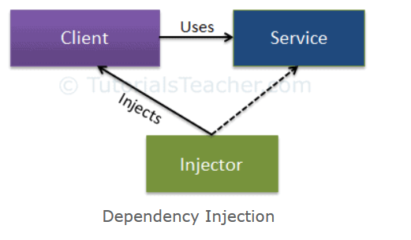

## 1.11 - Dependencies 
Elaborate on dependencies in software, and how it’s related to the subject of the test.
***
### Dependencies between layers
Most applications are layered. Each layer has responsibility for some specific functionality,
like presentation or business logic.

Dependencies between layers is just dependencies between program elements.

Although layered architecture enforces strict separation between the layers and dependencies
in **one** direction, typically in the majority of cases, such architectures become more "flexible"
and contains some bypasses.

Layers become challenging when they are violated and bypassed.

A good way of writing layers together that often ensures testability is using **dependency inversion** and 
**dependency injection** frameworks.

***
### System resources
System resources includes:

- System memory
- Cache memory
- Hard disk space
- DMA (Direct Message Access)

When using many dependencies in a system, the overall resource usage will increase linearly.

The more the system grows, it becomes increasingly relevant to limit the amount of resource usage to ensure
that the system won't overgrow the resource limitations, which will result in a longer response time from server,
and can also make the system more unstable overall.

The best way to decrease the amount of system resources used for a system, is to make sure that you only instantiate
objects when needed, and not instantiate more objects of the same type - if they can be reused.

A strategy to optimize your resource usage is to implement a IoC Container in your system.
This way you can better administrate and reuse objects, to keep your cache as small as possible.

***
### Relations between objects

***
### Dependency inversion, Inversion of Control, Dependency Injection

Dependency inversion principles (DIP) states that **High level modules should not depend on low level module;
Both should depend on abstractions. Abstractions should not depend on details. Details should depend upon abstractions**

DIP is one of the SOLID principles and part of Inversion of Control to obtain loose coupling.

The general idea is to ensure that the business Logic Layer doesn't have direct access to the data access layer.

This is done by implementing abstraction in form of an interface between the two layers, which insures that the method 
calls goes through the interface, instead of the data layer.

####When this is done we have not obtained loose coupling yet, only that the classes are loosely coupled.

**Dependency injection and strategy patterns** is used to move the dependency object creation completely out
of the classes.

Dependency injection pattern involves 3 types of classes.
1. **Client class:** The client class (dependent class) is a class which depends on the service class.
2. **Service class:** The service class (dependency) is a class that provides service to the client.
3. **Injector class:** The injector class injects the service class object into the client class.

**Three types of injections**
- Constructor injection
- Property injection
  - Method injection

      public class CustomerService {
          CustomerBusinessLogic _customerBL;
    
          public CustomerService(){

              _customerBL = new CustomerBusinessLogic(new CustomerDataAccess());
          }
    
          public string GetCustomerName(int id) {
              return _customerBL.ProcessCustomerData(id);
          }
      }

In the example above, CustomerDataAccess() in injected into CustomerBusinessLogic() in the service class.

#### These principles lead to Inversion of control.
Ioc is basically to obtain loose coupling in our program and by that make the code more maintainable.

The IoC principle suggests inverting the control, meaning that instead of driving the car yourself, you hire a 
cab, where another person will drive the car.

To fulfill IoC, you need to make object creation responsibility external compared to making each method/class
instantiating objects by themselves.\
This way you will make a much looser coupling between classes/methods, and also adding re-usability of the different
objects which makes the system use less resources as well.

***
### Mocks

Mocking is a process used in unit testing when the unit being tested has external dependencies.

The purpose of mocking is to isolate and focus on the code being tested and not on the behavior or state of external dependencies. In mocking, the dependencies are replaced by closely controlled replacements objects that simulate the behavior of the real ones.

There are three main possible types of replacement objects - **fakes, stubs and mocks**.

Example with hard-coded dependency

    public class DataTransformer {
    
        DataSource dataSource = new DBDataSource("some config");
    
        public int getSourceCount() {
            return dataSource.get().size();
        }
    }

Under normal circumstances the DataTransformer reads data from the DBDataSource, presumably from a database. Its function at the moment is simple: return the size of the data set. Since in this example the data source is instantiated explicitly, we have no means to replace it with a mock object for testing. We would like to be able to mock the DataSource nonetheless because we are testing DataTransformer only. Also, we are not interested in setting up a real environment from which a DBDataSource can read for us. We can solve this by injecting dependencies. Dependency injection can happen for example by passing the dependencies into a class via its constructor’s parameters.

Mock source

    public class DataSourceMock implements DataSource {
        @Override
        public List<Data> get() {
            return Arrays.asList(
        new Data("resolution", "fullhd"), new Data("memory", "16GB"));
        }
    }

Here we have a simple mock data source. We can modify the transformer so that it accepts the source.

Injected dependency

    public class DataTransformer {
    
        DataSource dataSource;
    
        public DataTransformer(DataSource dataSource) {
            this.dataSource = dataSource;
        }
    
        public int getSourceCount() {
            return dataSource.get().size();
        }
    }
This way our test can use the mock source above instead of having to fire up an actual data source connecting to a database.

    public class DataTransformerTest {
    
        DataTransformer dataTransformer;
    
        @Before
        public void setUp() {
            dataTransformer = new DataTransformer(new DBDataSourceMock());
    
        }
    
        @Test
        public void testSourceCount() {
            Assert.assertEquals(dataTransformer.getSourceCount(), 2);
        }
    }
