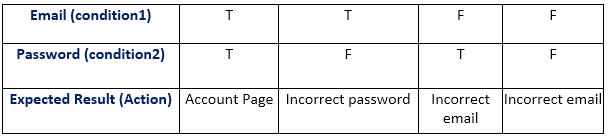

#Specification-based testing
Explain specification-based testing, and how you can be more confident that you have written a sufficient amount of tests.
****
###Equivalence partitioning
A software technique that divides the input data of a software unit input into partitions of
equivalent data from which test cases can be derived.\
It can be seen as a sort of black box testing technique.

- It divides input data of software into different equivalence data classes.
- You can apply this technique, where there is a range in the input field.

\
If you are to make a calculator that adds two sums together, is it then necessary to check if it calculates 5+5 correctly when you have testet for 4+4 and 3+3?
Equivalence partitions is a grouping of the same datatype.

Some equivalence partitions(classes) could be:

Males/females
* Those aged 0 to 17, 18 to 28, 29 to 44 and so on.
* those registered in the system before the year 2000 and those after.
* Prospects, regular, or premium customers.
* Those who pay with Visa, Mastercard, or PayPal.
* Those who have returned some merchandise and those who haven't.

****
###Boundary value analysis
When testing the boundary values we take our partitioned groups, and test if we get the right output for any given group.
In example, we have a discount given in our store of 5%  for young people (age 13 - 19), 8% for adults (age 20 - 50), 
and 14% for elders(age  51 - 80). Analysing, we see if we get the right discount amount, if we are going sell to a 
young person, adult and elder.

****
###Edge cases
In contrast to Boundary values, the edge cases is the test of the maximum, minimum, one below minimum and one above 
maximum. This is typically used with numbers, Strings, Dates/Time and Collections.

A case with numbers or Integers could be to ensure no integer overflow occurs.

With Strings, it could be a password with a minimum of 8 characters.

Date and time is what happens if we pass a specific date. Zune the microsoft mp4 player broke down new years eve 2000, 
because the dateTime formatting didn't work properly.

With collections, we need to test what happens if we have nothing in our collection. 
****

###Decision tables

A decision table is good for capturing all combinations of variables and possible outcomes.
The decision table is made up of **Conditions**, **condition alternatives**, **actions** and **Action entries**.

This is good in BDD where which emphasize shared understanding and concrete examples. \
These examples can be fed right in to a tool like Cucumber as a first building block of an automated acceptance test.
****
###Code coverage
Code coverage tools will use one or more criteria to determine how much of your code has bees covered by the test suits.

- Function coverage:
How many of the functions defined have been called.

- Statement coverage:
How many of the statements in the program have been executed.

- Branches coverage:
How many og the branches of the control structures (If statements, for instance) have been executed.

- Condition coverage:
How many boolean sub-expressions have been tested for a true and false value.

- Line coverage: 
How many lines of source code have been tested.

It is generally accepted that 80% coverage is a good goal.

****
###Mutation testing

