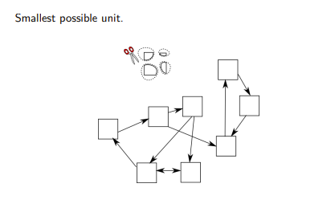
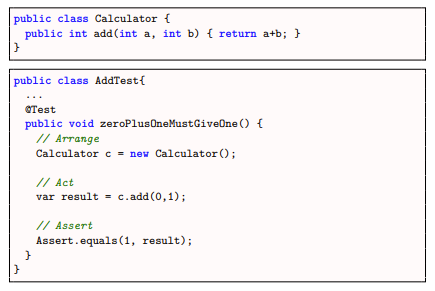
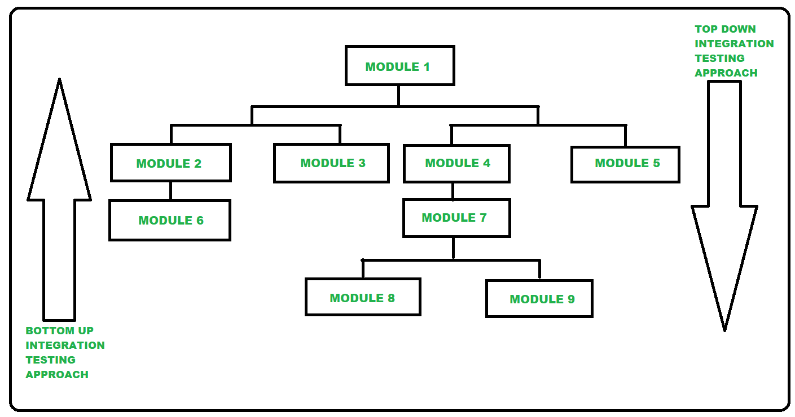
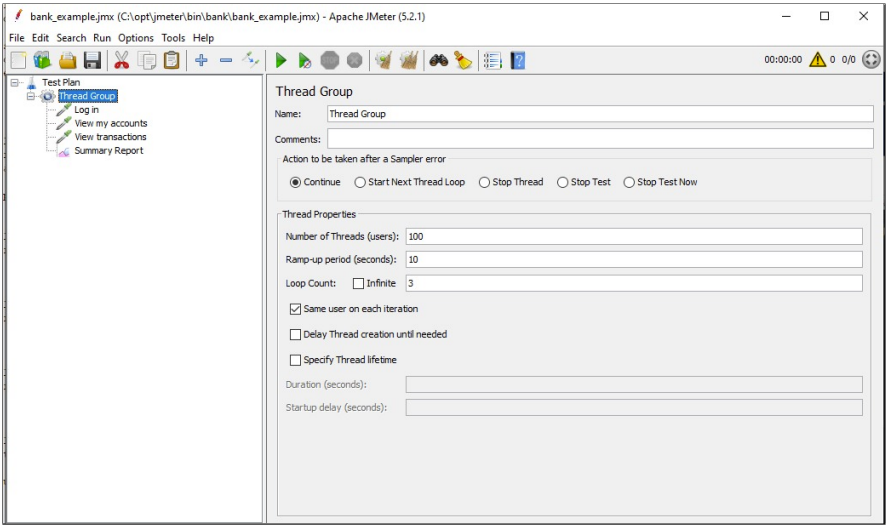
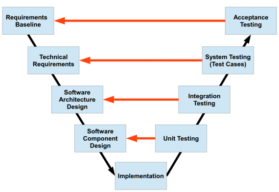

# 1.2 - Test Levels
Explain test levels, and what characterizes the individual levels. 
Then, relate to your own project.

***
## Unit testing

A unit test is testing the smallest possible part of a program.

It is done by isolating as much as possible of the code, and testing it individually.

Characteristics of a unit:

- It's a piece of code.
- Must test a unit of work.
- Must be automatic
- Must communicate errors found.

A unit test may not:

- No talking to a DB.
- No talking through a network.
- No touching the file system.
- Must be able to run at the same time as other tests.
- Must not require special workarounds or changes.

If any of the above points are used, it will be an integration test.

A classic tool for using unit tests is JUnit.

Example of a unit test with JUnit.

***
## Integration testing

Integrationstests er den fase hvor individuelle software moduler kombineres og testes som en gruppe.

Integrationstests laves for at evaluere om et system eller et komponent opfylder de specificerede funktionelle krav.

Test drivers (til Bottom-Up testing) og test stubs (til Top-Dowm testing) bliver ofte brugt til at assistere i integrationstests.

Forskellige tilgange til at lave integrationstests:

###  - Big Bang

Big Bang testing er en tilgang hvor man kombinerer alle (eller mange) unit tests, og tester det hele sammen.

Formålet er at teste fejl og mangler i interaktionen mellem integrerede units.

Denne tilgang bliver ofte brugt når en tester (eller et test hold) modtager hele koden som en pakke komponenter/moduler.

Forskellen mellem Big Bang testing og System testing er at Big Bang tester interaktionen mellem unit tests, 
hvorimod System Testing tester hele systemet.

### - Top Down

Top-Down testing er den type integrations tests hvor man tester systemet oppe fra og ned.

I Top-Down testing skal der bruges 'Test Stubs' til at simulere 'lower level units', som endnu ikke er tilgængelige.

Denne type testing er essentiel når man udvikler et system gennem Top-Down tilgangen - altså hvor man først udvikler de moduler som bruger mindre units.

Eksempel:

Hvis man udvikler en webapplikation, hvor man først laver brugerfladen (GUI'en) - og først til sidst i processen laver databasen.

Her vil man skulle lave en række Test Stubs, som leverer noget data som man kan arbejde med for at teste brugerfladen.

### - Bottom Up

Bottom-Up testing er den modsatte tilgang af Top-Down. Her vil man starte med at teste systemet nede fra og op.

Når man bruger Bottom-Up tilgangen vil man skulle lave en række 'Test Drivers', for at simulere brugen/samarbejdet af de individuelle units.

En Test-Driver er et slags modul/klasse som simulerer brugen af underliggende moduler/units.

Testdrivere er de moduler, der fungerer som midlertidig erstatning for et kaldende modul og giver samme output som det faktiske produkt.

### - Top-Down vs. Bottom-Up

- Sandwich
  - Horizontalt
  - Vertikalt

Sandwich tilgangen er en kombination af Top-Down og Bottom-Up.

Her vil man først teste Top tier moduler, og Bottom tier moduler - og arbejde sig ind til midten.

***
### System testing

System Testing / System Level testing / System Integrations tests - kært barn har mange navne.

System testing er hvor et QA (Kvalitetssikring) hold tester hvordan hele systemet arbejder sammen som en helhed.

System testing bruges bl.a. til at sikre at et program virker efter hensigten.

System testing er en form for Black-Box testing, hvor man fx. tester at hver eneste 'user input' producerer det resultat som man forventer, på tværs af hele applikationen.

Udover at teste at funktionerne virker efter hensigten, tester en system test også følgende:

- Performance testing

Hastighed, Stabilitet, Responstider ved Spidsbelastninger.

- Load testing

"Throughput", Antal brugere, Latency.

(Throughput er hvor mange enheder af information et system kan behandle på et givent tidsinterval)

- Usability testing

Bruger fejl rater, Succesrate for tasks, Tid til at fuldføre en given task, brugertilfredshed.

***
### Load testing

Load testing er en del af software ydeevne testing.

Overordnet handler det om at teste hvor meget kapacitet et program kan håndtere på forskellige parametre.

Load testing indebærer en række underpunkter:

- Stress testing

Stress testing er en type test som tester hvor meget kapacitet et program kan håndtere, før det crasher.

- Soak testing

Tester om et program kan håndtere en høj belastning over en længere periode.

- Spike testing

Hvordan håndterer programmet nogle store spikes i belastningen.

- Configuration testing

Plugin til formålet:

JMeter er et plugin som kan bruges til at sende en masse requests på kort tid, og dermed teste kapaciteten af programmet.

- JMeter kan lave Load Tests på Databaser.
- Det kan køres i command line.
- Derudover kan det køres gennem fx. Jenkins eller en anden CI manager (Continuous Integration).

Andre redskaber til formålet kan være <ins>Locust</ins> eller <ins>BlazeMeter</ins>.

***
### Static testing

Static testing er en strategi hvor man studerer og analyserer koden eller tilhørende dokumenter (såsom UML'er),
for at forhindre fejl - dog uden at køre koden.

Den primære årsag til at lave statisk tests, er for at finde fejl i en tidlig fase, hvor de er nemmere at løse/fjerne.

Hvilke ting kan der laves statisk tests på:

- Kravsspecifikationer
- Design dokumenter (fx. UML diagrammer)
- Bruger dokumenter
- Hjemmeside indhold.
- Kildekoden
- Test scenarioer

***
### Acceptance testing

Acceptance tests bruges til at validere om en given implementering lever op til de krav som Use Case/User Story specificerer.

Acceptance tests bliver udført at kunden / Product Owneren.

Hvis en acceptance test fejler, starter man forfra i processen i forhold til Verification/Validation modellen.

Acceptance tests bliver oftest beskrevet med Gherkin language.

"Gherkin language is a Business Readable, Domain Specific Language created especially for behavior descriptions. 
It gives you the ability to remove logic details from behavior tests. Gherkin serves two purposes: serving as your project's documentation and automated tests."

***
### Code examples:

- Unit Testing: [link](http://github.com/blah)
- Integration Testing: [link](http://github.com/blah)
- System Testing: [link](http://github.com/blah)
- Load Testing: [link](http://github.com/blah)
- Static Testing: [link](http://github.com/blah)
