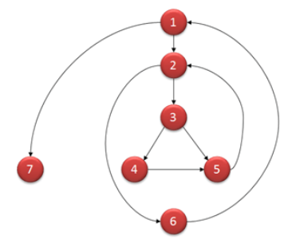

## 1.3 - Test without code
Explain what kinds of tests can be carried out without running any code. 
Explain how it can be used on non-code documents as well.
***
### Reviews
Formal reviews: 

- pre-planned meeting. 

- The team hands over the document in advance, so everybody is prepared for the meeting.

- Corrective actions are suggested.

\
Semi-formal reviews:

- Can occur many times during the course of developing.

- It is a presentation by the peron responsible.

- Question are taken throughout the presentation.

- Errors are pointed out, but no corrective actions are suggested.

\
Informal reviews:

- Think in the terms of a brainstorm.

- No agenda.

- This can happen by the coffee machine.

***
### Technical reviews
A Technical review is a static white-box testing technique which is conducted to spot the defects early in the life 
cycle that cannot be detected by black box testing techniques

- Technical Reviews are documented and uses a defect detection process that has peers and technical specialist as part of the review process.

- The Review process doesn't involve management participation.

- It is usually led by trained moderator who is NOT the author.

- The report is prepared with the list of issues that needs to be addressed.

***
### Management reviews
Systematic evaluation of a software by or on the behalf of management to monitor progress and to determine 
the status of plans and schedule.

- Check if the resources are allocated correctly.

- If necessary they can change the scope of the project

- Management reviews the progress of the program and evaluates why changes and/ or modifications
  should be mad.

####Expected output from Management reviews
A document to identify:
- Project under review.

- Review team members to check their skills and technical know-how

- Defects in the system.

***
### Audit
Audit means an independent examination of a software product or processes to assess compliance with specifications, 
standards, contractual agreements or other criteria.

It can be related to Software Quality Assurance (SQA)

The aim of conducting a software audit:
Provide an independent evaluation of the software project and processes to the agreed standards, 
both in planning guidelines and procedures.

***
### Static analysis
####What is Static analysis?
Analysing code without running it.

- Manual code review

- Automatic code review
  - Analasys
  - Contracts
  - Proofs
  
    
####Why Static analysis?
Prevent bugs instead of fixing them.

####Manuel code reviews

####Automated Approaches - Model
- Cyclomatic Complexity (CC)
  - A metric used to indicate the complexity of a program
  - Higher number = More complex code = Bad.

Flow graphs are used to calculate CC within a software program.

Formula for calculating code complexity:

    V(G) = E - N + 2
V(G) = the maximum number of independent paths in the graph.\
E = Number of edges.\
N = Number of nodes.

    V (G) = P + 1
P = predicate nodes. (Nodes that contain conditions)

Example:
    
    i = 0;
    n=4; //N-Number of nodes
    
    while (i<n-1) do
    j = i + 1;
    
    while (j<n) do
    
    if A[i]<A[j] then
    swap(A[i], A[j]);
    
    end do;
    i=i+1;
    
    end do;

    V(G) = 9 – 7 + 2 = 4
    V(G) = 3 + 1 = 4 (Condition nodes are 1,2 and 3 nodes)
    Basis Set – A set of possible execution path of a program
    1, 7
    1, 2, 6, 1, 7
    1, 2, 3, 4, 5, 2, 6, 1, 7
    1, 2, 3, 5, 2, 6, 1, 7

Basis Path testing is one of White box technique, and it guarantees to execute at least one statement during testing.
It checks each linearly independent path through the program, which means number test cases, will be equivalent
to the cyclomatic complexity of the program.

This metric is useful because of properties of Cyclomatic complexity (CC) –

1. CC can be number of test cases to achieve branch coverage (Upper Bound)
2. CC can be number of paths through the graphs. (Lower Bound)

    If (Condition 1)
    Statement 1
    
    Else
    Statement 2
    
    If (Condition 2)
    Statement 3
    
    Else
    Statement 4

Cyclomatic Complexity for this program will be 8-7+2=3.

| Complexity number | Meaning                                                                          |
|-------------------|----------------------------------------------------------------------------------|
| 1 - 10            | Structured and well written code High Testability  Cost and Effort is less |
| 10 - 20           | Complex Code  Medium Testibility  Cost and effort is minimum               |
| 20 - 40           | Very complex code  Low testability  Cost and efforts are High              |
| >40               | Not at all testable  Very high Cost and Effort                                |

Other tools for static analysis:
- Checkstyle
  - Coding standards and conventions.
- FindBugs
  - Finds bugs and potential future bugs
- PMD
  - Warns about bad practices
***
### Linters
Linter is an analysing tool to help improve code. It is in the Static analysis category. 

\
It's a type of automated check, which should happen early in development, before code reviews and testing.

\
This is done because automated code checks makes the code review and test processes more efficient.

The benefits:

- Fewer errors in production.

- Checks for code smell (Potential problems)

- Readable, maintainable and more consistent code.

#
PROS:
- Lint checks syntax errors and structural problems.

- Lint checks against best practices and code style guideline violations.

- Lint is inexpensive 

