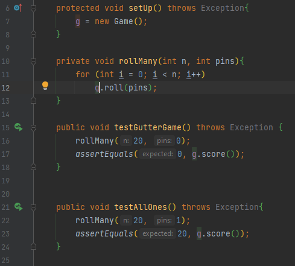

## 1.4 - Test Activities
Explain test activities, and how they are related to each other.\
Then explain the test activities you carried out in your project.
***
### Unit testing
####What?
The goal of unit testing is to test each unit in isolation. \
We test the smallest units possible.\
Examining each unit.

- It's a piece of the code.
- Must test a unit of work.
- Must be automated.
- Must communicate errors found. (Expected vs actual result)\

<b>Class</b>

    public class Calculator {
        public int add(int a, int b) { return a+b; }
    }
<b>Test for the class</b>

    public class AddTest{
    
        @Test
        public void zeroPlusOneMustGiveOne() {
    
        // Arrange
        Calculator c = new Calculator();
    
        // Act
        var result = c.add(0,1);

        // Assert
        Assert.equals(1, result);
        }
    }
####Why?
The claims are:\
- It helps to fix bugs early in development.

- It helps developers understand the code base.
  - By reading unit tests, you can see how the unit is used.
  - By writing unit tests, you have to think about use cases, edge cases, fault scenarios.
  

- It serves at documentation
  - Reading unit tests gives an understanding of the intentions / expectations.
  - Keeping unit tests is like keeping a log of requirements.

- It helps write code re-use 
  - Used in TDD, refactoring is an essential step, where code is used again.

####Purity
- Pure functions are easier to test
  - Returns the same value, when same argument(s) are given.
  - Has no side effects

Makes the function deterministic, meaning it is easier to test as it acts more like a mathematical function.
####Naming
Test names should be as descriptive as possible and consistent. (Camel case / SnakeCase)

Makes it easier to identify test that fails, and documents the intended behaviour.
***
### Integration testing

#### Why Integration test, if we have tested all units?
Although each software module is unit tested, defects still exists for various reasons.
- A module, in general, is designed by a single software developer whose understanding and programming logic may differ 
from other programmers. Integration is needed to make sure all modules work in unity.

- Requirements from the client could change, and the units might not have been tested for this.

- Interfaces of the software module could be incorrect.

- Inadequate exception handling could cause issues
#

Integration testing is defines as a type of testing where software modules are integrated logically and tested as a group

Integration testing focuses on checking data communication amongst modules.

This type of test focuses mainly on the interface and flow of data/information between modules, where priority is given\
to the integration link rather than the unit test, which has already been tested.

The integration could be with another system, which makes it a black-box testing.

Approaches:
- Big Bang - All components and modules are integrated and tested as a unit.
- Top Down - Uses Stubs.
- Bottom Up - Uses Drivers
- Sandwich - combination of Top down and Bottom up
***
### Refactoring
When writing a lot of unit tests for a program, there tends to accumulate a lot of duplicated code, if we do not keep an eye out for this.\
The way we keep duplicated code down to a minimum is by making our own small code reviews.

####Example of refactoring

Good practice:
- Always start from green:
   - Never refactor anything when a code is failing.
   

- Extract what's common into the test fixture
   - As seen in the example above, shoppingBasket is being instantiated outside the tests.
   - This could also be done in a @BeforeAll setup(){ }

See this example from our Bowling assignment:

***
### Maintenance
A Majority of a system's life cycle is about maintenance.Once a piece of software has been rolled out into production, 
it goes into maintenance, which falls into either of two categories:

1. Maintenance of a system under development
   - Where a system is still under development and new features are still added to the system.

1. Patching and bug fixing.
   - The system has been stable for a while, and requires relatively little intervention, but once in a while
   - A defect pops up and a bug must be fixed.

Both types of maintenance require that the code is written with testability in mind. If this is not done, attempts to 
change the code into a nightmare which leads to legacy code.
***
### Continuous Integration
When deploying code, we can hit "Merge hell" when pushing to the cloud, if we don't push often enough.

When we use Continuous Integration, we push everytime we have built a small piece that is tested and works. It doesn't 
have to be a full functioning program.
In github when we push, we can add automation which always keeps an eye on the code. When code is pushed, it 
automatically builds the code and tests it. then it pushes the code to the others in the team.

if a conflict occurs, an email is sends to the team, telling where the conflict is, and who has been working on the code.
this makes sure that we always have a testable build.

***
### Code reviews
Also known as peer review. 
This refers to a software quality assurance activity, where one or several people checks a program,
mainly by reading parts of the source code. - At least one of the people must not be the code's author, the other people are called reviewers.\
Be aware of author bias

Code reviews are done to ensure
- Better code quality.
- finding defects
- Increase sense of mutual responsibility
- finding better solutions
- complying to QA guidelines, ISO standards
