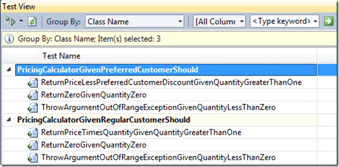
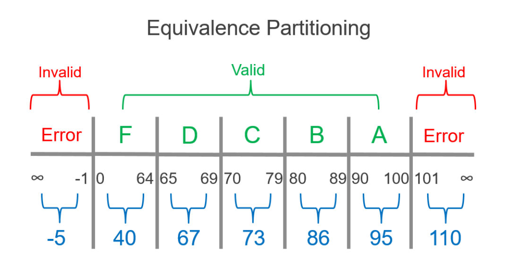

# 1.5 - Code Quality
Testing is related to ensuring higher code quality. 
Elaborate on what characterizes high code quality, and what makes code testable.
***
## Testable code

To create testable code, it's important to follow a set of principles.

###### Observability

First of all, we need to make sure that the SUT (System under Test) is observable.
Without the possibility to check wheither or not our tests have made the impact we wanted, the test will be useless.

Observability should be thought about very early in the development phase, to make sure the SUD is programmed correctly for later testing.

The different ways of observing a SUT, can include:

- Debugging
- System Outputs
- Loggers

###### Controllability

Controllability is the ability to change the states of something in a SUT.

It is both neccesary to test functionality, but also leads to reproducibility.

A state means the possibility to change fields, variables or parameters to produce different outputs.

###### Deployability

Deployability is a measure of the amount of work needed to deploy a given system.

To get a rough feeling - ask yourself:

"How long does it take to get a change that affects one line of code into production."

###### Isolability

Isolability is, as the name suggests, the focus on isolating code parts as much as possible.

In many ways, it is similar to low coupling - and therefore desirable for both developers and testers.

The lower coupling a programs modules have, the easier it is to test and reuse the modules.

###### Smallness

The smaller the software, the better testability - because there's less to test.

###### Singularity

If something is singular, there's only one instance of it.

In systems with high singularity, every behavior and piece of data have a single source of truth.
Whenever we want to make a change, we make it in one place.

###### Level of Abstraction

Level of Abstraction is determined by the choice of programming language as well as the IDE.

With modern languages and frameworks, they tend to do a lot of things 'under the hood', which means that there's less code to test.

###### Efficiency

Efficiency refers to the ability to use the given programming language's functionality to keep the code expressive and concise.

###### Reusability

Reusability means using third-party components to avoid reinventing the wheel.
When using components from previous systems or from external source codes, we can make sure that the SUD is as
small as possible, which again means fewer tests needed to be done.
***
## Names of tests

Here are the basic rules for naming tests:

- No rigid naming policy. You can’t fit a high-level description of a complex behavior into a narrow box of such a policy. Allow freedom of expression.

- Name the test as if you were describing the scenario to a non-programmer person who is familiar with the problem domain. A domain expert or a business analyst are good examples.

- Separate words by underscores. It helps improve readability of long names.

#### *Example of naming tests*

***
## “sufficient” tests of a method or class

There's no direct guidelines to follow, when you want to find out when you have made enough tests for a single method/class.

But if we take an example of a function taking a input number between 1 and 100 - it's important to have equivalence 
partitioning in mind, along with edge case testing.

When we talk about an input field for numbers, it's also important to test that we get the correct error handling, when inputting letters, empty or spaces is entered.

***
## Assertions, defensive programming

Defensive programming is about assuring that you cover all the neccesary parts to create tests that will catch errors efficiently.

#### 1. Always check the preconditions

To make sure that we can create a proper test, we need to know about the preconditions.

By checking the preconditions for a scenario which needs to be tested, we will find out what information we need from the SUT (System under Test) to make a proper test.

#### 2. Check your postconditions

We also need to know about the postconditions on a given scenario.

This also ensures that we can determine wheither or not our test calculates for the requires postconditions.

#### 3. Check your invariants

Man skal sikre sig at variabler som kan ændre under en test, er statiske.

Fx. et objekt skal testes, som har et ur i sig. Her skal man sikre at uret leverer en statisk værdi, vha. fx en stub.

An invariant is a condition or relation that is always true. The definition is modified somewhat for
 concurrent execution: an invariant is a condition or relation that is true when the associated lock is being set.

#### 4. Remember the ACID rules

ACID rules is a set of rules regarding database transactions.

###### - Atomicy

The transaction must be completed fully. If it is not completed fully it will not be recorded.

###### - Consistency

Any change must not break the database. It must be consistent with how it was before the change.

###### - Isolation

A transaction must be isolated and not interfere with another transaction.

###### - Durability

A transaction must remain in the database.

#### 5. Test correct error handling

You must make sure to test the error handling as well. 
Testing that the method/class returns the correct errors when given wrong input, is as crucial as testing the correct inputs.

***
## Dependency injection

Dependency Injection is a programming technique that makes a class independent of its dependencies.
“In software engineering, dependency injection is a technique whereby one object supplies the dependencies of another object.

If a function/object/module depends on some other function/object/module, it should not go out and get what it needs.
Instead, we explicitly give it anything it needs, typically by passing it in as a function parameter.

Example:

    public class TestInfoTest {
        //constructor with depencency injection
        TestInfoTest(TestInfo testInfo) {
            assertEquals("TestInfotest", testInfo.getDisplayname());
        }
    
        @BeforeEach
        void setUp(TestInfo testInfo) {
            String displayName = testInfo.getDisplayName();
            assertTrue(displayName.equals("display name of the method") ||
                       displayName.equals("testGetNameOfTheMethod(TestInfo)"));
        }
    
        @Test
        void testGetNameOfTheMethod(TestInfo testInfo) {
            assertEquals("testGetNameOfTheMethod(TestInfo)",
                    testInfo.getDisplayName());
        }
    
        @Test
        @DisplayName("display name of the method")
        testGetNameOfTheMethodWithDisplayNameAnnotation(TestInfo testInfo) {
            assertTrue("display name of the method", testInfo.getDisplayName());
        }
    }

https://freecontent.manning.com/dependency-injection-and-testing-in-junit/
