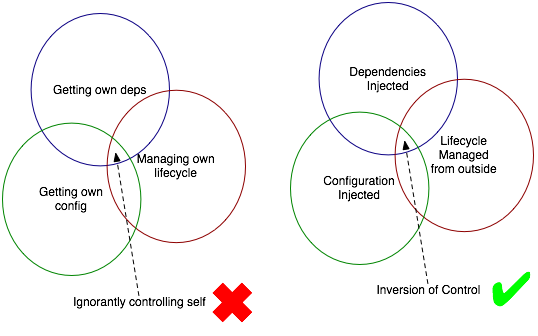

## 1.6 - Maintainable Code

Explain the concept of maintainable code, and how it’s related to test. 
Explain how to find out if a code base is maintainable.
***
### Maintainability

To write maintainable bode, we have to keep the following in mind when we write our program:

- Low coupling, high cohesion
  Is how easy the code is to work on for another developer and maintain.
  This suggests that we through our code keep a low coupling and high cohesion.

- Static Analysis
  We have to be aware of our code complexity through static analysis, where we use tools such as
  Cyclomatic Complexity, findBugs (To chek for present and future bugs), checkStyle (Keep coding standards and conventions)
  and PMD. (Warns about bad practices)

- Continuous Integration
  Is so that we always keep a tested and new build running.
  It also insures that when frequently pushes of code, merge conflicts won't cause too much refactoring.

***
### Product quality

Good product quality is a good thing to have, when you want maintainable code!

***
### Temporal coupling

Temporal coupling is when there's an implicit relationship between two or more objects/classes - 
where it's required to use the functions in the correct order to make the functionality work.

This creates a very tight coupling, which can be toucher to test and further develop later on.

    var b = new EndpointAddressBuilder();
    b.Uri = new UriBuilder().Uri;
    var e = b.ToEndpointAddress();

In the example above, there is a temporal coupling between 3 different methods, 
which needs to run in the correct order to work.

As with all forms of coupling, it’s really not possible to eliminate temporal coupling completely.\
But if left unchecked, it can cripple your ability to change your codebase.\
If you want to keep your temporal coupling low, you need to learn how to recognize its forms and apply the 
appropriate patterns to reduce it.

When using temporal coupling, it is essential that you focus on immutability to prevent an object being changed, 
and later on called by a temporal coupled method.

*Example of getting into trouble using mutations*

    Car car = new Car();
    car.setDistanceUnit("miles");
    car.drive(100);
    (...)
    car.setDistanceUnit("kilometers");  - Here we mutate the object created above.
    (...)
    car.drive(100);                     - Here we run into problems, because we might want to drive 100 miles or kilometers - who knows?

Instead of changing the state (mutating) of the car - another car should be made for the purpose.

***
### Continuous Integration

When deploying code, we can hit "Merge hell" when pushing to the cloud, if we don't push often enough.

When we use Continuous Integration, we push everytime we have built a small piece that is tested and works. It doesn't
have to be a full functioning program.
In GitHub when we push, we can add automation which always keeps an eye on the code. When code is pushed, it
automatically builds the code and tests it. then it pushes the code to the others in the team.

if a conflict occurs, an email is sends to the team, telling where the conflict is, and who has been working on the code.
this makes sure that we always have a testable build.

***
### Static Analysis

#### What is Static analysis?

Analysing code without running it.

- Manual code review

- Automatic code review
    - Analasys
    - Contracts
    - Proofs
    
#### Why Static analysis?

Prevent bugs instead of fixing them.

#### Manuel code reviews

#### Automated Approaches - Model
- Cyclomatic Complexity (CC)
    - A metric used to indicate the complexity of a program
    - Higher number = More complex code = Bad.

Flow graphs are used to calculate CC within a software program.

Formula for calculating code complexity:

    V(G) = E - N + 2
V(G) = the maximum number of independent paths in the graph.\
E = Number of edges.\
N = Number of nodes.

    V (G) = P + 1
P = predicate nodes. (Nodes that contain conditions)

Example:

    i = 0;
    n=4; //N-Number of nodes
    
    while (i<n-1) do
    j = i + 1;
    
    while (j<n) do
    
    if A[i]<A[j] then
    swap(A[i], A[j]);
    
    end do;
    i=i+1;
    
    end do;

    V(G) = 9 – 7 + 2 = 4
    V(G) = 3 + 1 = 4 (Condition nodes are 1,2 and 3 nodes)
    Basis Set – A set of possible execution path of a program
    1, 7
    1, 2, 6, 1, 7
    1, 2, 3, 4, 5, 2, 6, 1, 7
    1, 2, 3, 5, 2, 6, 1, 7

Basis Path testing is one of White box technique, and it guarantees to execute at least one statement during testing.
It checks each linearly independent path through the program, which means number test cases, will be equivalent
to the cyclomatic complexity of the program.

This metric is useful because of properties of Cyclomatic complexity (CC) –

1. CC can be number of test cases to achieve branch coverage (Upper Bound)
2. CC can be number of paths through the graphs. (Lower Bound)

    If (Condition 1)
    Statement 1
    
    Else
    Statement 2
    
    If (Condition 2)
    Statement 3
    
    Else
    Statement 4

Cyclomatic Complexity for this program will be 8-7+2=3.

| Complexity number | Meaning                                                                          |
|-------------------|----------------------------------------------------------------------------------|
| 1 - 10            | Structured and well written code High Testability  Cost and Effort is less |
| 10 - 20           | Complex Code  Medium Testability  Cost and effort is minimum               |
| 20 - 40           | Very complex code  Low testability  Cost and efforts are High              |
| >40               | Not at all testable  Very high Cost and Effort                                |

Other tools for static analysis:
- Checkstyle
    - Coding standards and conventions.
- FindBugs
    - Finds bugs and potential future bugs
- PMD
    - Warns about bad practices

***
### Dependency injection & Inversion of control

#### Dependency Injection

Dependency Injection is a programming technique that makes a class independent of its dependencies.
“In software engineering, dependency injection is a technique whereby one object supplies the dependencies of another object.

If a function/object/module depends on some other function/object/module, it should not go out and get what it needs.
Instead, we explicitly give it anything it needs, typically by passing it in as a function parameter.

Example:

    public class TestInfoTest {
        //constructor with depencency injection
        TestInfoTest(TestInfo testInfo) {
            assertEquals("TestInfotest", testInfo.getDisplayname());
        }
    
        @BeforeEach
        void setUp(TestInfo testInfo) {
            String displayName = testInfo.getDisplayName();
            assertTrue(displayName.equals("display name of the method") ||
                       displayName.equals("testGetNameOfTheMethod(TestInfo)"));
        }
    
        @Test
        void testGetNameOfTheMethod(TestInfo testInfo) {
            assertEquals("testGetNameOfTheMethod(TestInfo)",
                    testInfo.getDisplayName());
        }
    
        @Test
        @DisplayName("display name of the method")
        testGetNameOfTheMethodWithDisplayNameAnnotation(TestInfo testInfo) {
            assertTrue("display name of the method", testInfo.getDisplayName());
        }
    }

https://freecontent.manning.com/dependency-injection-and-testing-in-junit/

#### Inversion of control

Inversion of Control (IoC) is a programming principle.\
IoC inverts the flow of control as compared to traditional control flow.

The general purpose of using IoC is to create looser coupling between classes, and thereby increasing testability and 
maintainability.

To fulfill IoC, you need to make object creation responsibility external compared to making each method/class 
instantiating objects by themselves.\
This way you will make a much looser coupling between classes/methods, and also adding re-usability of the different 
objects which makes the system use less resources as well.

##### *How to achieve loose coupling using IoC containers.*

Step 1:
- You have a bunch of tightly coupled classes.

Step 2:
- You implement the IoC using factory patterns.

Step 3:
- You create abstraction between classes by using a Dependency Injection Principle (DIP) which involves creating 
interfaces for the classes to communicate with each other.

Step 4:
- You implement Dependency Injection by changing the method/classes, so they take the necessary objects as parameters 
instead of instantiating the objects themselves.

Step 5:
- You create a IoC container (a sort of 'objectFactory') which holds all the objects which are needed for different 
classes/methods.

Step 6:
- You now have a much looser coupling between classes/modules, which helps with testing, maintenance and further 
development.

***
### Low coupling, high cohesion

Low Coupling / Loose Coupling makes it easier to maintain a code base. DUH!

High Cohesion is good as well. It makes sure that you know exactly how the code runs, as well as minimizing the changes 
of intruders being able to manipulate the code into doing something you don't want it to do.

***
### Cyclomatic code complexity

- A metric used to indicate the complexity of a program
- Higher number = More complex code = Bad.

Flow graphs are used to calculate CC within a software program.

Formula for calculating code complexity:

    V(G) = E - N + 2
V(G) = the maximum number of independent paths in the graph.\
E = Number of edges.\
N = Number of nodes.

    V (G) = P + 1
P = predicate nodes. (Nodes that contain conditions)

Example:

    i = 0;
    n=4; //N-Number of nodes
    
    while (i<n-1) do
    j = i + 1;
    
    while (j<n) do
    
    if A[i]<A[j] then
    swap(A[i], A[j]);
    
    end do;
    i=i+1;
    
    end do;

    V(G) = 9 – 7 + 2 = 4
    V(G) = 3 + 1 = 4 (Condition nodes are 1,2 and 3 nodes)
    Basis Set – A set of possible execution path of a program
    1, 7
    1, 2, 6, 1, 7
    1, 2, 3, 4, 5, 2, 6, 1, 7
    1, 2, 3, 5, 2, 6, 1, 7

Basis Path testing is one of White box technique, and it guarantees to execute at least one statement during testing.
It checks each linearly independent path through the program, which means number test cases, will be equivalent
to the cyclomatic complexity of the program.

This metric is useful because of properties of Cyclomatic complexity (CC) –

1. CC can be number of test cases to achieve branch coverage (Upper Bound)
2. CC can be number of paths through the graphs. (Lower Bound)

    If (Condition 1)
    Statement 1
    
    Else
    Statement 2
    
    If (Condition 2)
    Statement 3
    
    Else
    Statement 4

Cyclomatic Complexity for this program will be 8-7+2=3.

| Complexity number | Meaning                                                                          |
|-------------------|----------------------------------------------------------------------------------|
| 1 - 10            | Structured and well written code High Testability  Cost and Effort is less |
| 10 - 20           | Complex Code  Medium Testability  Cost and effort is minimum               |
| 20 - 40           | Very complex code  Low testability  Cost and efforts are High              |
| >40               | Not at all testable  Very high Cost and Effort                                |

Other tools for static analysis:
- Checkstyle
  - Coding standards and conventions.
- FindBugs
  - FindBugs and potential future bugs
- PMD
  - Warns about bad practices

