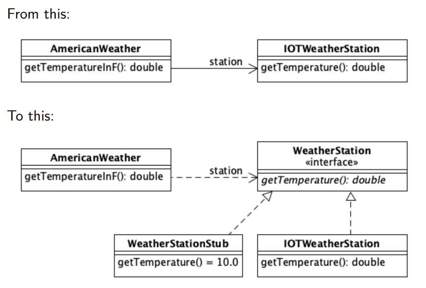

## 1.7 - Unit Testing

Explain unit testing, and what characterizes it in contrast to other types of test.
***
### What and why

_"A unit test may exercise a function or method, a class, or even a cluster of collaborating classes that provide some specific functionality" - le book._\
This description is quite fluffy, and it is therefore important to define the meaning of a unit when working with other people.

We use unit testing to **ensures that all code meets quality standards before it's deployed**.

***
### Unit Under Test / System Under Test

Unit Under Test (DUT)refers to a manufactured product undergoing testing, either at first manufacture or later during its life cycle as part of ongoing functional testing and calibration checks.

System under test (SUT) refers to a system that is being tested for correct operation

The AAA (Arrange, Act, Assert) pattern is a common way of writing unit tests for a method under test.

    public class Calculator {
        public int add(int a, int b) { return a+b; }
    }

    public class AddTest {
        @Test
        public void zeroPlusZeroMustGiveZero() {
        // Arrange
        Calculator c = new Calculator();
        // Act
        var result = c.add(0,0);
        // Assert
        Assert.equals(expected, result);
        }
    }

***
### Unit test lifecycle(BeforeAll, AfterAll / SetUp, TearDown)

In general, a test framework make no guarantees about the order of execution of the individual test methods, and some even randomize the execution order on purpose. This is a good thing, because it makes it virtually impossible to create tests that are coupled to each other.\
Why is this important?

In order to become repeatable and consistent, unit tests must be executed from a known state.

**text fixture** a fixed state of program elements that the test depends on.

The need for initializers become apparent one the test class/module contains **three or more** test that run the same or very similar setup code.

**That's fine and all.. what does this mean in coding?**

In JUnit 5, the test lifecycle is driven by four primary annotations i.e. **@BeforeAll**, **@BeforeEach**, **@AfterEach** and **@AfterAll**.

The complete lifecycle of a test case can be seen in three phases with the help of annotations.

**Setup:** This phase puts the test infrastructure in place. JUnit provides class level setup (@BeforeAll) and method level setup (@BeforeEach). Generally, heavy objects like database connections are created in class level setup while lightweight objects like test objects are reset in the method level setup.\
**Test Execution:** In this phase, the test execution and assertion happen. The execution result will signify a success or failure.\
**Cleanup:** This phase is used to clean up the test infrastructure setup in the first phase. Just like setup, teardown also happen at class level (@AfterAll) and method level (@AfterEach).\

Example på rækkefølge.

    public class AppTest {
    
        @BeforeAll
        static void setup(){
            System.out.println("@BeforeAll executed");
        }
    
        @BeforeEach
        void setupThis(){
            System.out.println("@BeforeEach executed");
        }
    
        @Test
        void testCalcOne()
        {
            System.out.println("======TEST ONE EXECUTED=======");
            Assertions.assertEquals( 4 , Calculator.add(2, 2));
        }
    
        @Test
        void testCalcTwo()
        {
        System.out.println("======TEST TWO EXECUTED=======");
        Assertions.assertEquals( 6 , Calculator.add(2, 4));
        }
    
        @AfterEach
        void tearThis(){
            System.out.println("@AfterEach executed");
        }
    
        @AfterAll
        static void tear(){
            System.out.println("@AfterAll executed");
        }
    }

***
###Test doubles (mock, fake, stub, spy)

####Stub

_A method that returns a known value_

    class CollaboratorStub : ICollaborator {
        public int ComputeAndReturnValue() {
            return 10;
        }
    }

    public void CanonicalTestWithStub() {
        var tested = new TestedObject(new CollaboratorStub());
        Assert.AreEqual(10, tested.ComputeSomething());
    }

####Fake

Den her er svær at forklare men bogen har et godt eksempel på side 162 - 164 hvis min forklaring ikke er fyldsgørende.

Fakes are used when stubbing isn't enough. 

_When the behavior that would be stubbed away is required by the test object._

A senario would be a test object that invoices a method that does some logic. Based on the logic the invocation made, the test class needs to do something.

An example:

    public Invoice MakePurchase(Customer customer, Product product, Discount discount) {
        var purchase = purchaseFacade.CreatePurchase(customer);
        purchaseFacade.AddProduct(purchase, product);
        var invoice = purchaseFacade.CreateInvoice(purchase);
        
        if (discount != null) {
            invoice.ApplyDiscount(discount);
        }
        return invoice;
    }

CreatePurchase, AddProduct, and CreateInvoice all result in data being created and persisted somehow.

Once all data related to making a purchase are persisted, a discount **may optionally be applied**.

The reason we can't stub this is because the _ApplyDiscount_  method refreshes the invoice object based on the data in the database.

In this example, **PurchaseFacade** would be a fake implementation that would produce correct enough invoices, while avoiding persistence and all complicated business rules that usually govern the creation of such entities.

####Mock Object

**Stubs** provide indirect input in a controlled manner. 

**Fakes** replace collaborators with simpler self-consistent implementations.

Given these, the missing piece of the puzzle is **the ability to verify indirect output**.

**Mock** shifts the focus from state to behavior.

Behavior-based tests goal is to **verify that
certain interactions have occurred** between the mock object and the tested code or
another collaborator.

This scenario illustrates the primary use of mock objects: verification of interactions.

There's many ways of mocking, and they depend on the frameworks used. See page 164 - 170 for example.

####Spy

A test spy is **a function that records arguments, return value, the value of this and exception thrown (if any) for all its calls.**

the difference between mocks and spies is that the
mock itself uses the captured values to determine whether the interaction happened
correctly, whereas the spy leaves this decision to the test.

Example

    @Test
    public void whenSpyingOnList_thenCorrect() {
        List<String> list = new ArrayList<String>();
        List<String> spyList = Mockito.spy(list);
    
        spyList.add("one");
        spyList.add("two");
    
        Mockito.verify(spyList).add("one");
        Mockito.verify(spyList).add("two");
    
        assertEquals(2, spyList.size());
    }

####Dummies

Dummies are values you don't care about from the perspective of the test.

    String firstname = "";

dummies are usually arguments.

***
### Test Driven Development

_"Test-driven development is a way of using tests to drive the design of the code"_

By writing the test before the code, we make the code decoupled and testable.

Test-driven development is performed in a three-phase cycle:

1. Write a failing test
2. Make it pass
3. Refactor

The refactoring stage is crucial to the technique’s success, because this is where
many principles of good design are applied.

There are three ways of making tests pass:
* Faking - Returning the expected value hard-coded to fake a computation
* The obvious implementation - Using the obvious code that would solve the problem
* Triangulation - Teasing out the algorithm by providing example after example of different inputs and expected results

Common challenges when introducing test-driven development are
* Our code can’t be tested - The misconception that legacy code is beyond redemption
* Our code is special - The misconception that the organization’s code is more complex than others
* Test-driven development isn’t complete testing—The misconception that testdriven development is useless because it must be complemented by other means of quality assurance
* Starting from zero - The lack of fundamental practices that precede test

***
### Dependency Injection

Dependency Injection is a programming technique that makes a class independent of its dependencies. 
“In software engineering, dependency injection is a technique whereby one object supplies the dependencies of another object.

If a function/object/module depends on some other function/object/module, it should not go out and get what it needs.
Instead, we explicitly give it anything it needs, typically by passing it in as a function parameter.

Example:

    public class TestInfoTest {
        //constructor with depencency injection
        TestInfoTest(TestInfo testInfo) {
            assertEquals("TestInfotest", testInfo.getDisplayname());
        }
    
        @BeforeEach
        void setUp(TestInfo testInfo) {
            String displayName = testInfo.getDisplayName();
            assertTrue(displayName.equals("display name of the method") ||
                       displayName.equals("testGetNameOfTheMethod(TestInfo)"));
        }
    
        @Test
        void testGetNameOfTheMethod(TestInfo testInfo) {
            assertEquals("testGetNameOfTheMethod(TestInfo)",
                    testInfo.getDisplayName());
        }
    
        @Test
        @DisplayName("display name of the method")
        testGetNameOfTheMethodWithDisplayNameAnnotation(TestInfo testInfo) {
            assertTrue("display name of the method", testInfo.getDisplayName());
        }
    }

https://freecontent.manning.com/dependency-injection-and-testing-in-junit/

***
### Equivalence classes, boundary value analysis, equivalence partitions

####Equivalence classes

Same as Equivalence partitions 

####Boundary Value Analysis
Boundary Value Analysis is a Black-Box testing technique used to check the errors at the boundaries of an input domain.

focuses on testing **both valid and invalid input parameters**.

Et konkret example er valuta.

Hvis du konvetere 50USD til den fattigeste valuta(et afrikansk land.. mener det er zimbawe) vil der overstige Integers max værdi, på 2,147,483,647, og derved give en integeroverflow fejl.

####Equivalence partitions

If you are to make a calculator that adds two sums together, is it then necessary to check if it calculates 5+5 correctly when you have testet for 4+4 and 3+3?
Equivalence partitions is a grouping of the same datatype.

Some equivalence partitions(classes) could be:

Males/females
* Those aged 0 to 17, 18 to 28, 29 to 44 and so on.
* those registered in the sytem before the year 2000 and those after.
* Prospects, regular, or premium customers.
* Those who pay with Visa, Mastercard, or Paypal.
* Those who have returned some merchandise and those who haven't.

