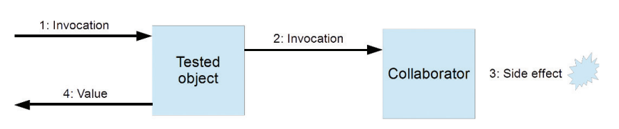
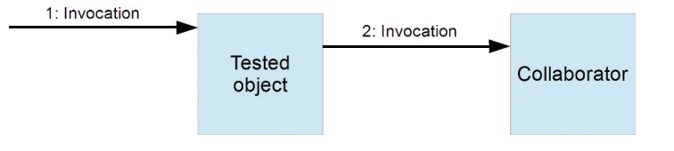

## 1.9 - Test Doubles
Explain about test doubles. Explain how and why mocking is useful, and in what test areas.
***
### Mockito, mocks, spies, stubs, fakes, dummies

### Mockito
#### How do you verify that a mock was called?

In mockito you can verify if a specific method has been called x numbers of times. \
This is done with the verify() method.

    verify(mockObject).someMethodOfMockObject(someArgument);

The verify() method checks by default if the class has been called one time but
can be set to check a specific number of times.

    verify(mockObject, times(someNumberOfTimes)).someMethodOfMockObject(someArgument);

#### How do you verify that a mock was NOT called?

To check if a method is never called. mockito has a method called never() that can be added as a 2nd parameter.

    verify(mockObject, never()).someMethodOfMockObject(someArgument);

#### How do you specify how many times a mock should have been called?

To check if a method is called a specific number of times mockito has a method called times() that can be added as a 2nd parameter and takes an int numbersOfTimes.

    verify(mockObject, times(someNumberOfTimes)).someMethodOfMockObject(someArgument);

#### How do you verify that a mock was called with specific argument?

    List<String> mockedList = mock(MyList.class);
    mockedList.addAll(Lists.<String> newArrayList("someElement"));

    ArgumentCaptor<List> argumentCaptor = ArgumentCaptor.forClass(List.class);
    verify(mockedList).addAll(argumentCaptor.capture());

    List<String> capturedArgument = argumentCaptor.<List<String>> getValue();
    assertThat(capturedArgument, hasItem("someElement"));

#### How do you use a predicate to verify the properties of the arguments given to a call to the mock?

Mockito has multiple ways the create ArgumentMatchers. Using Fixed Values is one of them is to return fixed values:

    doReturn("someClass").when(someService).analyze("propertiesToCheck");

####Stub

_A method that returns a known value_

    class CollaboratorStub : ICollaborator {
        public int ComputeAndReturnValue() {
            return 10;
        }
    }

    public void CanonicalTestWithStub() {
        var tested = new TestedObject(new CollaboratorStub());
        Assert.AreEqual(10, tested.ComputeSomething());
    }

####Fake

Den her er svær at forklare men bogen har et godt eksempel på side 162 - 164 hvis min forklaring ikke er fyldsgørende.

Fakes are used when stubbing isn't enough.

_When the behavior that would be stubbed away is required by the test object._

A senario would be a test object that invoices a method that does some logic. Based on the logic the invocation made, the test class needs to do something.

An example:

    public Invoice MakePurchase(Customer customer, Product product, Discount discount) {
        var purchase = purchaseFacade.CreatePurchase(customer);
        purchaseFacade.AddProduct(purchase, product);
        var invoice = purchaseFacade.CreateInvoice(purchase);
        
        if (discount != null) {
            invoice.ApplyDiscount(discount);
        }
        return invoice;
    }

CreatePurchase, AddProduct, and CreateInvoice all result in data being created and persisted somehow.

Once all data related to making a purchase are persisted, a discount **may optionally be applied**.

The reason we can't stub this is because the _ApplyDiscount_  method refreshes the invoice object based on the data in the database.

In this example, **PurchaseFacade** would be a fake implementation that would produce correct enough invoices, while avoiding persistence and all complicated business rules that usually govern the creation of such entities.

####Mock Object

**Stubs** provide indirect input in a controlled manner.

**Fakes** replace collaborators with simpler self-consistent implementations.

Given these, the missing piece of the puzzle is **the ability to verify indirect output**.

**Mock** shifts the focus from state to behavior.

Behavior-based tests goal is to **verify that
certain interactions have occurred** between the mock object and the tested code or
another collaborator.

This scenario illustrates the primary use of mock objects: verification of interactions.

There's many ways of mocking, and they depend on the frameworks used. See page 164 - 170 for example.

####Spy

A test spy is **a function that records arguments, return value, the value of this and exception thrown (if any) for all its calls.**

the difference between mocks and spies is that the
mock itself uses the captured values to determine whether the interaction happened
correctly, whereas the spy leaves this decision to the test.

Example

    @Test
    public void whenSpyingOnList_thenCorrect() {
        List<String> list = new ArrayList<String>();
        List<String> spyList = Mockito.spy(list);
    
        spyList.add("one");
        spyList.add("two");
    
        Mockito.verify(spyList).add("one");
        Mockito.verify(spyList).add("two");
    
        assertEquals(2, spyList.size());
    }

####Dummies

Dummies are values you don't care about from the perspective of the test.

    String firstname = "";

dummies are usually arguments.

***
### Dependency injection

Dependency Injection is a programming technique that makes a class independent of its dependencies. “In software engineering, dependency injection is a technique whereby one object supplies the dependencies of another object.

If a function/object/module depends on some other function/object/module, it should not go out and get what it needs. Instead, we explicitly give it anything it needs, typically by passing it in as a function parameter.

example:

    public class TestInfoTest {
        //constructor with depencency injection
        TestInfoTest(TestInfo testInfo) {
            assertEquals("TestInfotest", testInfo.getDisplayname());
        }
    
        @BeforeEach
        void setUp(TestInfo testInfo) {
            String displayName = testInfo.getDisplayName();
            assertTrue(displayName.equals("display name of the method") ||
                       displayName.equals("testGetNameOfTheMethod(TestInfo)"));
        }
    
        @Test
        void testGetNameOfTheMethod(TestInfo testInfo) {
            assertEquals("testGetNameOfTheMethod(TestInfo)",
                    testInfo.getDisplayName());
        }
    
        @Test
        @DisplayName("display name of the method")
        testGetNameOfTheMethodWithDisplayNameAnnotation(TestInfo testInfo) {
            assertTrue("display name of the method", testInfo.getDisplayName());
        }
    }

https://freecontent.manning.com/dependency-injection-and-testing-in-junit/

***
### Interfaces, contracts

***
### Black-box vs white-box (bb -> equivalence partitioning)
